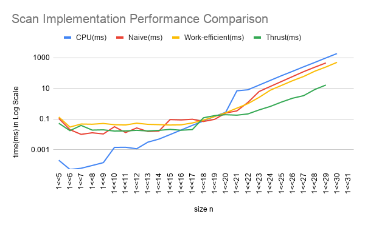
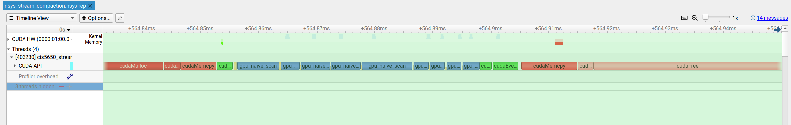
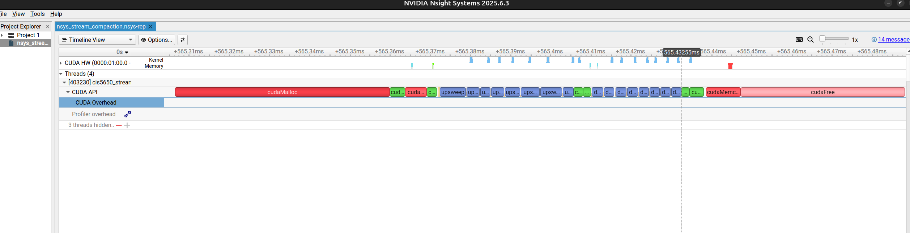
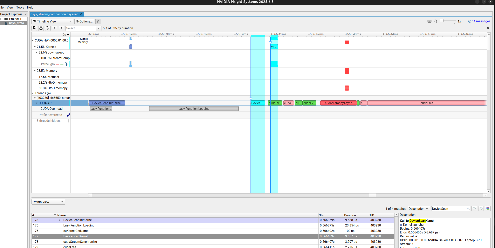

CUDA Stream Compaction
======================

**University of Pennsylvania, CIS 565: GPU Programming and Architecture, Project 2**

## Yanfu Ou
  * [LinkedIn](https://www.linkedin.com/in/yanfuou/)
* Tested on: Framework 16 - Ubuntu 24.04LTS, Ryzen 7 7840HS @ 2.5GHz 64GB DDR4, RTX 5070 8GB vRAM GPU Laptop

## Project Description
This project seeks to understand different scan and compaction algorithmic implementations to explore their performance differences. I implemented exclusive prefix-sum (scan) on the CPU, Naive approach on GPU, Work Efficient on GPU, and Nvidia Thrust library. I further implemented stream compaction on both the CPU and GPU, utilizing the scan function that I've written. These implementations are inspired by Nvidia [Documentation](https://developer.nvidia.com/gpugems/gpugems3/part-vi-gpu-computing/chapter-39-parallel-prefix-sum-scan-cuda) <em>"Chapter 39. Parallel Prefix Sum (Scan) with CUDA"</em>. Performance is analyzed using Nvidia Nsight Systems and `timer().startGpuTimer()`.     


### Features
- GPU Naive scan: ping-pong global-memory kernels, `O(n log n)` work
- GPU Work-efficient scan: in-place upsweep / downsweep, `O(n)` work, padded to the next power of two for Non Power-of-Two inputs
- GPU stream compaction on top of the work-efficient scan (mask → scan → scatter)
- GPU using Nvidia Thrust scan wrapper around `thrust::exclusive_scan` on device vectors
- CPU exclusive scan (`O(n)` sequential loop)
- CPU stream compaction without scan (direct pack of non-zeros)
- CPU stream compaction with scan (map → scan → scatter)
- Power-of-two and non-power-of-two tests, Release-mode timing, block-size tuning (best overall: 256)

## Project Analysis

### Performance Analysis 



For small n, CPU clearly dominates. Among the GPU implementations, naive and Thrust are faster than work-efficient. Work-efficient is usually the slowest GPU option at small sizes (for example at `1<<8`: naive 0.013 ms, Thrust 0.019 ms, work-efficient 0.045 ms) because later upsweep/downsweep passes leave most threads idle while still launching a full grid. The `1<<5` GPU row is a cold CUDA start and should not be used for ranking.

Around `2^18` to `2^20` the four implementations are in the same ballpark (about 0.07–0.28 ms).

Beyond that, Thrust pulls away. NVIDIA's CUB-backed `exclusive_scan` uses far fewer kernel launches than my naive and work-efficient scans, which cuts launch overhead. Scan is still memory-bound. Thrust uses memory more cleverly by just moving more of the tree through shared memory in a few kernels instead of one global-memory kernel per tree level.

For large n, work-efficient is second. Its `O(n)` work finally beats naive's `O(n log n)` global-memory traffic. Naive is third among the GPUs not because of low occupancy, since almost every naive thread works every pass. Rather, because it does more memory I/O. CPU is last above about `2^20` because it is a single sequential loop.

GPU times exclude `cudaMalloc` / `cudaMemcpy`, so at small n the bottleneck in these measurements is kernel launches (and idle work-efficient threads), not host-device copies. Addition itself is cheap. That is why work-efficient's lower arithmetic complexity does not help until n is large.

At `1<<30`, naive and Thrust each need two 4 GB device buffers and OOM on the 8 GB GPU. Work-efficient is in-place, so it still runs. 

| size n     | CPU(ms) | Naive(ms)   | Work-efficient(ms) | Thrust(ms)  |
| ----- | ------------ | ------------ | -------------- | ------------ |
| 1<<5  | 0.000201     | 0.108832     | 0.134016       | 0.052352     |
| 1<<6  | 0.00005      | 0.02         | 0.029664       | 0.01728      |
| 1<<7  | 0.00006      | 0.009888     | 0.046752       | 0.037984     |
| 1<<8  | 0.000091     | 0.012512     | 0.045376       | 0.018784     |
| 1<<9  | 0.00014      | 0.010496     | 0.051008       | 0.019552     |
| 1<<10 | 0.001392     | 0.031232     | 0.042144       | 0.016256     |
| 1<<11 | 0.001412     | 0.012928     | 0.040608       | 0.016576     |
| 1<<12 | 0.001132     | 0.025888     | 0.05328        | 0.018112     |
| 1<<13 | 0.003056     | 0.0152       | 0.044608       | 0.016512     |
| 1<<14 | 0.004849     | 0.016352     | 0.042528       | 0.018016     |
| 1<<15 | 0.009578     | 0.091296     | 0.040416       | 0.020896     |
| 1<<16 | 0.019105     | 0.086432     | 0.041632       | 0.0184       |
| 1<<17 | 0.038192     | 0.096064     | 0.054976       | 0.020288     |
| 1<<18 | 0.074339     | 0.06848      | 0.083392       | 0.119904     |
| 1<<19 | 0.147976     | 0.094592     | 0.144448       | 0.165888     |
| 1<<20 | 0.276466     | 0.245408     | 0.256992       | 0.190208     |
| 1<<21 | 6.928882     | 0.337152     | 0.50928        | 0.17712      |
| 1<<22 | 8.107503     | 1.221024     | 1.010944       | 0.214624     |
| 1<<23 | 16.461376    | 6.244256     | 2.59392        | 0.39184      |
| 1<<24 | 33.179955    | 13.333536    | 7.578912       | 0.659232     |
| 1<<25 | 67.141464    | 28.017471    | 15.537376      | 1.267776     |
| 1<<26 | 130.228943   | 59.076225    | 31.683489      | 2.271776     |
| 1<<27 | 257.637939   | 124.105377   | 60.007999      | 3.342752     |
| 1<<28 | 496.142273   | 242.526855   | 132.665146     | 8.419552     |
| 1<<29 | 979.672546   | 461.196869   | 249.650116     | 16.567104    |
| 1<<30 | 1895.528809  | device OOM   | 504.365509     | device OOM   |


### Why is my work-efficient GPU scan slower? (Part 5, extra credit +5)
It boils down to the following main reasons:
- Deeper upsweep/downsweep levels have very low occupancy: only threads with `idx % 2^(d+1) == 0` do work (aka 50% → 25% → … → 1 thread do effective work). Most threads simply idle.
- The same full grid (`n / blockSize` blocks) is launched every pass, so later kernels still pay a full launch to run almost no work.
- Those idle threads can be dropped by shrinking the grid each pass: launch `n / 2^(d+1)` threads instead of `n`.
- Compact the remaining threads with an index remap: thread `tid` owns node `k = tid << (d + 1)` (same nodes the `%` test selected). Left/right children stay `k + 2^d - 1` and `k + 2^(d+1) - 1`. Same kernel body, just no modulo filter. This implementation would be similar to the one taught in lecture

### Nsight Systems timeline comparison

##### Naive Scan 
We can see a long series of small kernels. 


##### Work efficient
We can see a denser series of upsweep/downsweep kernels.


##### Thrust
We do not see the long chain of per-level kernels from naive and work-efficient. Thrust replaces them with a few `DeviceScan` kernels, which cuts launch overhead. Scan remains memory-bound. Fewer launches just mean less time spent starting tiny kernels.


This supports the analysis above. My naive and work-efficient implementations pay a lot of kernel-launch overhead. Thrust performs the scan in very few kernels. 

##### Block Size Tuning

I swept `blockSize` from 8 to 1024 at n = `2^24`, large enough that occupancy and memory traffic matter. Naive's min is 10.22 ms at `blockSize = 512`. Work-efficient's min is 5.94 ms at `blockSize = 256`. Naive at 256 is essentially tied with 512 (10.28 vs 10.22 ms), so I use 256 overall.  

| blockSize | Naive(ms) | Work-efficient(ms) | 
| --------- | --------- | ------------------ | 
| 8         | 55.366623 | 96.489502          | 
| 16        | 27.027905 | 48.726143          | 
| 32        | 13.51312  | 25.301472          | 
| 64        | 10.288256 | 12.660448          | 
| 128       | 10.268864 | 6.7248             | 
| 256       | 10.283296 | 5.94016            | 
| 512       | 10.21744  | 6.21584            | 
| 1024      | 10.84192  | 8.997952           | 
| Min       | 10.21744  | 5.94016            | 

## Full Test Program Output

The following is the output build in Release mode. size = 256

```
****************
** SCAN TESTS **
****************
Input array: 
    [  30   2  53   6  84  19  26   3  43  53   1  90  68 ...  55   0 ]
==== cpu scan, power-of-two ====
Output array: 
   elapsed time: 0.000882ms    (std::chrono Measured)
    [   0  30  32  85  91 175 194 220 223 266 319 320 410 ... 11783 11838 ]
==== cpu scan, non-power-of-two ====
   elapsed time: 0.00012ms    (std::chrono Measured)
    passed 
==== naive scan, power-of-two ====
    [   0  30  32  85  91 175 194 220 223 266 319 320 410 ... 11783 11838 ]
   elapsed time: 0.05824ms    (CUDA Measured)
    passed 
==== naive scan, non-power-of-two ====
   elapsed time: 0.011104ms    (CUDA Measured)
    passed 
==== work-efficient scan, power-of-two ====
   elapsed time: 0.172544ms    (CUDA Measured)
    passed 
==== work-efficient scan, non-power-of-two ====
   elapsed time: 0.036384ms    (CUDA Measured)
    passed 
==== thrust scan, power-of-two ====
   elapsed time: 0.048032ms    (CUDA Measured)
    passed 
==== thrust scan, non-power-of-two ====
   elapsed time: 0.015872ms    (CUDA Measured)
    passed 

*****************************
** STREAM COMPACTION TESTS **
*****************************
    [   2   2   1   2   0   3   2   3   3   1   1   2   0 ...   3   0 ]
==== cpu compact without scan, power-of-two ====
   elapsed time: 0.000421ms    (std::chrono Measured)
    [   2   2   1   2   3   2   3   3   1   1   2   1   2 ...   3   3 ]
    passed 
==== cpu compact without scan, non-power-of-two ====
   elapsed time: 0.000401ms    (std::chrono Measured)
    [   2   2   1   2   3   2   3   3   1   1   2   1   2 ...   2   1 ]
    passed 
==== cpu compact with scan ====
   elapsed time: 0.000982ms    (std::chrono Measured)
    [   2   2   1   2   3   2   3   3   1   1   2   1   2 ...   3   3 ]
    passed 
==== work-efficient compact, power-of-two ====
   elapsed time: 0.016672ms    (CUDA Measured)
    passed 
==== work-efficient compact, non-power-of-two ====
   elapsed time: 0.005056ms    (CUDA Measured)
    passed
```